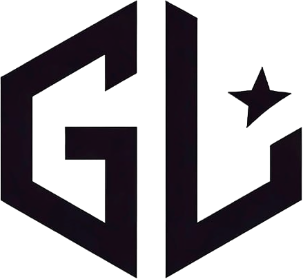

# 🎮 GameLeague Timer

<div align="center">



**Профессиональный таймер для спидранов и игровых сессий**

[](https://github.com/YOUR_USERNAME/GameLeague-Timer/releases)
[](https://github.com/YOUR_USERNAME/GameLeague-Timer/releases)
[](LICENSE)
[](https://github.com/DeadKDV)

</div>

---

## 📋 Содержание

- [🌟 Особенности](#-особенности)
- [📥 Установка](#-установка)
- [🚀 Быстрый старт](#-быстрый-старт)
- [⚙️ Настройки](#️-настройки)
- [🎨 HTML Таймер](#-html-таймер)
- [🔗 WebSocket API](#-websocket-api)
- [🔐 Безопасность](#-безопасность)
- [📖 Руководство пользователя](#-руководство-пользователя)
- [🛠️ Для разработчиков](#️-для-разработчиков)
- [❓ FAQ](#-faq)
- [🤝 Поддержка](#-поддержка)

---

## 🌟 Особенности

<table>
<tr>
<td width="50%">

### ⏱️ **Основные функции**
- ✅ Точный таймер с миллисекундной точностью
- ✅ Система игр с автосохранением времени
- ✅ Горячие клавиши для управления
- ✅ Режим обратного отсчета
- ✅ Overlay таймер поверх всех окон

</td>
<td width="50%">

### 🎨 **Визуальные настройки**
- ✅ Выбор любого системного шрифта
- ✅ Настраиваемые цвета и прозрачность
- ✅ HTML таймер для стримов
- ✅ Тема проэкта и разработчика

</td>
</tr>
<tr>
<td width="50%">

### 🌐 **Интеграции**
- ✅ Google OAuth авторизация
- ✅ WebSocket сервер для OBS
- ✅ GameLeague интеграция
- ✅ Экспорт логов и статистики
- ✅ Автоматические обновления

</td>
<td width="50%">

### 🔧 **Технические особенности**
- ✅ Шифрование настроек
- ✅ Портативный EXE файл
- ✅ Система инсталляции
- ✅ Backup и восстановление
- ✅ Многоязычная поддержка

</td>
</tr>
</table>

---

## 📥 Установка

### 🎯 Простая установка (Рекомендуется)

1. **Скачайте последнюю версию** из [Releases](https://github.com/YOUR_USERNAME/GameLeague-Timer/releases/latest)
2. **Запустите** `TGL_1.1.9.exe`
3. **Выберите папку** для установки при первом запуске
4. **Готово!** Ярлык появится на рабочем столе

### 💻 Системные требования

<table>
<tr>
<td><strong>ОС</strong></td>
<td>Windows 10/11 (64-bit)</td>
</tr>
<tr>
<td><strong>ОЗУ</strong></td>
<td>2 GB (рекомендуется 4 GB)</td>
</tr>
<tr>
<td><strong>Место на диске</strong></td>
<td>100 MB</td>
</tr>
<tr>
<td><strong>Интернет</strong></td>
<td>Для авторизации и обновлений</td>
</tr>
</table>

---

## 🚀 Быстрый старт

### 1️⃣ **Первый запуск**

<details>
<summary>📸 Показать скриншоты</summary>


*Главное окно приложения*

</details>

1. При первом запуске выберите **папку для установки**
2. Приложение автоматически создаст **ярлык на рабочем столе**
3. Настройки будут **зашифрованы и сохранены**

### 2️⃣ **Добавление игры**

```
📂 Главное меню → Выбор игры → Добавить игру
```

1. **Введите название** игры
2. **Укажите URL изображения** (опционально)
3. **Установите время для прохождения** (опционально)
4. Нажмите **"Сохранить"**

### 3️⃣ **Начало таймера**

```
🎮 Выберите игру → Далее → Старт
```

**Горячие клавиши по умолчанию:**
- `F1` - Старт/Пауза
- `F2` - Сброс (настраивается)

---

## ⚙️ Настройки

### 🎮 **Основные настройки**

<details>
<summary>🔧 Горячие клавиши</summary>

- **Любая комбинация клавиш**: `Ctrl+Space`, `F1`, `Alt+S` и т.д.
- **Глобальные хоткеи**: Работают даже когда приложение свернуто
- **Безопасная установка**: Автоматическое освобождение при ошибках

</details>

<details>
<summary>🌐 Google OAuth</summary>

- **Безопасная авторизация** через Google
- **Синхронизация** между устройствами
- **Экспорт результатов** в Google Sheets
- **Зашифрованное хранение** токенов

</details>

<details>
<summary>🔄 Автообновления</summary>

- **Автоматическая проверка** новых версий
- **Безопасная установка** через PowerShell
- **Backup настроек** перед обновлением
- **Откат** при необходимости

</details>

---

## 🎨 HTML Таймер

### 🎬 Для стримеров и видео

HTML таймер идеально подходит для:
- **OBS Studio** - добавление через Browser Source
- **Streamlabs** - виджет для стримов
- **Видеозаписи** - наложение таймера
- **Веб-страницы** - встраивание таймера

### ⚙️ **Настройки HTML таймера**

<table>
<tr>
<td width="30%"><strong>Настройка</strong></td>
<td width="70%"><strong>Описание</strong></td>
</tr>
<tr>
<td>🖋️ Шрифт</td>
<td>Выбор из всех установленных системных шрифтов</td>
</tr>
<tr>
<td>📏 Размер</td>
<td>4 размера: Очень маленький, Маленький, Средний, Большой</td>
</tr>
<tr>
<td>🎨 Цвет таймера</td>
<td>Любой цвет для отображения времени</td>
</tr>
<tr>
<td>🌈 Фон таймера</td>
<td>Цвет фона блока с таймером</td>
</tr>
<tr>
<td>👻 Прозрачность</td>
<td>От 0% (невидимый) до 100% (непрозрачный)</td>
</tr>
<tr>
<td>🔘 Скругление</td>
<td>Радиус скругления углов (0-500px)</td>
</tr>
<tr>
<td>📐 Отступы</td>
<td>Внутренние отступы блока (10-100px)</td>
</tr>
<tr>
<td>🔤 Формат времени</td>
<td>Показ часов, минут, секунд</td>
</tr>
<tr>
<td>✏️ Обводка</td>
<td>Обводка цифр с настройкой цвета и толщины</td>
</tr>
</table>

### 🌐 **Использование в OBS**

1. **Запустите WebSocket сервер** в настройках
2. **Скопируйте ссылку** `http://localhost:8765/`
3. **Добавьте Browser Source** в OBS
4. **Вставьте URL** и настройте размеры

```
📋 Рекомендуемые настройки OBS:
Width: 800px
Height: 200px
FPS: 30
```

---

## 🔗 WebSocket API

### 🔌 **Подключение**

```javascript
const ws = new WebSocket('ws://localhost:8765/ws');

ws.onmessage = function(event) {
    const time = event.data; // Формат: "HH:MM:SS"
    console.log('Timer:', time);
};
```

### 📡 **Endpoints**

| Endpoint | Метод | Описание |
|----------|-------|----------|
| `/` | GET | HTML страница с таймером |
| `/ws` | WebSocket | Поток времени в реальном времени |

### 💡 **Примеры использования**

<details>
<summary>🌐 Простая веб-страница</summary>

```html
<!DOCTYPE html>
<html>
<head>
    <title>GameLeague Timer</title>
</head>
<body>
    <div id="timer">00:00:00</div>
    <script>
        const ws = new WebSocket('ws://localhost:8765/ws');
        ws.onmessage = (e) => {
            document.getElementById('timer').textContent = e.data;
        };
    </script>
</body>
</html>
```

</details>

<details>
<summary>⚛️ React компонент</summary>

```jsx
import React, { useState, useEffect } from 'react';

function GameLeagueTimer() {
    const [time, setTime] = useState('00:00:00');

    useEffect(() => {
        const ws = new WebSocket('ws://localhost:8765/ws');
        ws.onmessage = (event) => setTime(event.data);
        return () => ws.close();
    }, []);

    return <div className="timer">{time}</div>;
}
```

</details>

---

## 🔐 Безопасность

### 🛡️ **Защита данных**

- **Шифрование AES-256** всех настроек
- **Безопасное хранение** Google токенов
- **Локальное шифрование** без передачи в интернет
- **Автоматическое удаление** временных файлов

### 🔑 **OAuth безопасность**

- **Официальный Google OAuth 2.0** протокол
- **Минимальные разрешения** (только email)
- **Отзыв доступа** в любой момент
- **Зашифрованное хранение** refresh токенов

---

## 📖 Руководство пользователя

### 🎯 **Типичные сценарии использования**

<details>
<summary>🏃 Спидран</summary>

1. **Добавьте игру** с целевым временем
2. **Настройте хоткей** для быстрого управления
3. **Запустите таймер** в начале попытки
4. **Используйте Overlay** для отображения поверх игры
5. **Сохраните результат** автоматически

</details>

<details>
<summary>📺 Стрим</summary>

1. **Настройте HTML таймер** под дизайн стрима
2. **Запустите WebSocket сервер**
3. **Добавьте Browser Source** в OBS
4. **Настройте прозрачность** и позицию
5. **Управляйте таймером** горячими клавишами

</details>

<details>
<summary>📊 Аналитика</summary>

1. **Ведите статистику** по играм
2. **Экспортируйте логи** в JSON
3. **Анализируйте прогресс** по времени
4. **Сравнивайте** с целевыми показателями
5. **Делитесь результатами** через Google OAuth

</details>

### ⚡ **Горячие клавиши**

| Действие | Клавиша по умолчанию | Настраивается |
|----------|---------------------|---------------|
| Старт/Пауза | `F1` | ✅ |
| Сброс | `F2` | ✅ |
| Overlay | - | ✅ |
| Режим отсчета | - | ✅ |

### 🎨 **Темы**

**Темная тема (по умолчанию):**
- Фон: `#181f2a`
- Акцент: `#7b5cff`
- Текст: `#e6e6e6`

**Светлая тема:**
- Фон: `#ffffff`
- Акцент: `#7b5cff`
- Текст: `#000000`

---

## 🛠️ Для разработчиков

### 🏗️ **Архитектура**

```
GameLeague Timer
├── 🎮 Main Application (PyQt5)
├── 🌐 WebSocket Server (aiohttp)
├── 🔐 Encryption System (cryptography)
├── 🔄 Update Manager (GitHub API)
├── 📊 Game Management
└── 🎨 HTML Generator
```

### 🔧 **Сборка из исходного кода**

<details>
<summary>📝 Требования</summary>

```bash
Python 3.13+
PyQt5
aiohttp
websockets
cryptography
requests
keyboard
google-auth-oauthlib
pywin32
```

</details>

<details>
<summary>🚀 Инструкции</summary>

```bash
# 1. Клонируйте репозиторий
git clone https://github.com/YOUR_USERNAME/GameLeague-Timer.git
cd GameLeague-Timer

# 2. Установите зависимости
pip install -r requirements.txt

# 3. Запустите из исходного кода
python main.py

# 4. Создайте EXE файл
python build_exe.py 1.2.0
```

</details>

### 📦 **Структура проекта**

```
📁 GameLeague-Timer/
├── 📄 main.py                 # Основное приложение
├── 📄 updater.py             # Система обновлений
├── 📄 build_exe.py           # Сборка EXE
├── 📄 encrypted_config.py    # Шифрование настроек
├── 📄 install_dialog.py      # Диалог установки
├── 📄 client_secret.json     # Google OAuth конфиг
├── 📄 requirements.txt       # Зависимости Python
├── 📁 log/                   # Логи игр
├── 🖼️ logo.png              # Логотип
├── 🖼️ logo.ico              # Иконка
└── 📄 README.md              # Этот файл
```

---

## ❓ FAQ

<details>
<summary>🤔 Не работают горячие клавиши</summary>

**Решение:**
1. Запустите приложение **от имени администратора**
2. Проверьте, что **клавиши не заняты** другими программами
3. Попробуйте **другую комбинацию** клавиш
4. Перезапустите приложение

</details>

<details>
<summary>🌐 Не подключается WebSocket</summary>

**Решение:**
1. Проверьте, что **сервер запущен** в настройках
2. Убедитесь, что **порт 8765 свободен**
3. Отключите **антивирус/файрвол** временно
4. Попробуйте **другой порт** в настройках

</details>

<details>
<summary>🔐 Проблемы с Google OAuth</summary>

**Решение:**
1. Проверьте **интернет соединение**
2. Обновите приложение до **последней версии**
3. Очистите **кэш браузера**
4. Попробуйте **другой браузер**

</details>

<details>
<summary>🎨 HTML таймер не отображается в OBS</summary>

**Решение:**
1. Убедитесь, что **WebSocket сервер запущен**
2. Проверьте **URL**: `http://localhost:8765/`
3. Установите **ширину 800px, высоту 200px**
4. Включите **"Shutdown source when not visible"**

</details>

<details>
<summary>🔄 Не работают обновления</summary>

**Решение:**
1. Запустите **от имени администратора**
2. Проверьте **интернет соединение**
3. Отключите **антивирус** временно
4. Скачайте **вручную** с GitHub

</details>

---

## 🤝 Поддержка

### 💬 **Способы связи**

- 🐛 **Баги и предложения**: [GitHub Issues](https://github.com/YOUR_USERNAME/GameLeague-Timer/issues)
- 💡 **Идеи**: [GitHub Discussions](https://github.com/YOUR_USERNAME/GameLeague-Timer/discussions)
- 📧 **Email**: your.email@example.com
- 💬 **Discord**: YourDiscord#1234

### 🎁 **Поддержать проект**

Если таймер оказался полезным:

- ⭐ **Поставьте звезду** на GitHub
- 🐛 **Сообщите о багах** в Issues
- 💡 **Предложите улучшения**
- 📢 **Расскажите друзьям**

### 📝 **Лицензия**

```
MIT License

Copyright (c) 2024 DeadKDV

Permission is hereby granted, free of charge, to any person obtaining a copy
of this software and associated documentation files (the "Software"), to deal
in the Software without restriction, including without limitation the rights
to use, copy, modify, merge, publish, distribute, sublicense, and/or sell
copies of the Software, and to permit persons to whom the Software is
furnished to do so, subject to the following conditions:

The above copyright notice and this permission notice shall be included in all
copies or substantial portions of the Software.

THE SOFTWARE IS PROVIDED "AS IS", WITHOUT WARRANTY OF ANY KIND, EXPRESS OR
IMPLIED, INCLUDING BUT NOT LIMITED TO THE WARRANTIES OF MERCHANTABILITY,
FITNESS FOR A PARTICULAR PURPOSE AND NONINFRINGEMENT. IN NO EVENT SHALL THE
AUTHORS OR COPYRIGHT HOLDERS BE LIABLE FOR ANY CLAIM, DAMAGES OR OTHER
LIABILITY, WHETHER IN AN ACTION OF CONTRACT, TORT OR OTHERWISE, ARISING FROM,
OUT OF OR IN CONNECTION WITH THE SOFTWARE OR THE USE OR OTHER DEALINGS IN THE
SOFTWARE.
```

---

<div align="center">

**🎮 GameLeague Timer - Ваш профессиональный спутник в мире гейминга! 🎮**

*Сделано с ❤️ от [DeadKDV](https://github.com/DeadKDV)*

[](https://github.com/YOUR_USERNAME/GameLeague-Timer/stargazers)
[](https://github.com/YOUR_USERNAME/GameLeague-Timer/network/members)

</div> 
